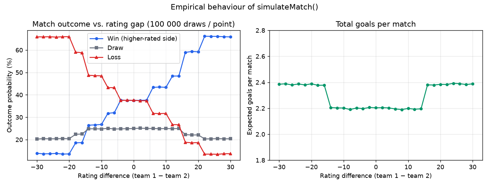

# World Cup Simulator & Analyzer

[](https://www.php.net/)
[](public/assets/js/dashboard.js)
[](database/schema.sql)
[](database/schema.sqlite.sql)
[](LICENSE)

A full-stack web application that simulates a 16-team FIFA World Cup tournament — group draw,
round-robin group stage, single-elimination knockout bracket — using a **rating-based stochastic
match model**, and persists every simulated edition in a relational database for later analysis.

The user interface is a Persian (RTL) admin dashboard; the code, API and documentation are in English.

<p align="center">
  
  <br>
  <sub>Monte-Carlo characterisation of the match engine (100 000 simulated matches per data point).</sub>
</p>

---

## Table of Contents

1. [Features](#features)
2. [Architecture](#architecture)
3. [Simulation Engine](#simulation-engine)
4. [REST API](#rest-api)
5. [Database Schema](#database-schema)
6. [Getting Started](#getting-started)
7. [Configuration](#configuration)
8. [Security Notes](#security-notes)
9. [Project Structure](#project-structure)
10. [Limitations & Future Work](#limitations--future-work)
11. [License](#license)

---

## Features

| Area | Details |
|------|---------|
| **Team pool** | 178 national teams across six confederations (AFC, CAF, CONCACAF, CONMEBOL, OFC, UEFA), each with a strength rating (46 – 94) and flag |
| **Team selection** | Search, confederation filter, manual pick, or one-click random selection of exactly 16 teams |
| **Group draw** | Random shuffle into four groups (A – D) of four teams |
| **Group stage** | Full round-robin (6 matches per group, 24 in total); standings sorted by points → goal difference → goals scored |
| **Knockout stage** | Quarter-finals (A1–B2, C1–D2, B1–A2, D1–C2), semi-finals, final; draws are re-simulated, with an "extra-time" tiebreaker |
| **Persistence** | Every completed tournament (teams, groups, standings, all 31 match results, bracket, champion) is stored as a JSON document |
| **History** | Reload any past edition into the dashboard, or delete it |
| **Authentication** | Server-side session login with bcrypt-hashed credentials |
| **UI** | Responsive RTL layout, dark/light theme, match-detail modal, toast notifications |

---

## Architecture

```
┌────────────────────────────┐        JSON over HTTP        ┌─────────────────────────────┐
│  Browser (vanilla JS)      │ ───────────────────────────▶ │  PHP 8 API (public/api/)    │
│                            │                              │                             │
│  login.js     – auth flow  │  POST /api/auth.php          │  auth.php     – sessions    │
│  dashboard.js – simulation │  GET|POST|DELETE             │  tournaments.php – CRUD     │
│               – rendering  │       /api/tournaments.php   │  bootstrap.php – config,    │
│               – API client │ ◀─────────────────────────── │                  PDO, JSON  │
└────────────────────────────┘                              └──────────────┬──────────────┘
                                                                           │ PDO (prepared statements)
                                                              ┌────────────▼──────────────┐
                                                              │  MySQL 8  ·or·  SQLite 3  │
                                                              │  tournaments(id, date,    │
                                                              │     champion, data JSON)  │
                                                              └───────────────────────────┘
```

* **Thick client, thin server.** The whole tournament simulation runs in the browser; the server is
  responsible only for authentication and persistence. This keeps the API surface tiny (two endpoints)
  and makes the simulation engine trivially testable in Node.js.
* **Document-style storage.** A tournament is an immutable snapshot, so it is stored as a single JSON
  document with a few indexed scalar columns (`creation_date`, `champion`) for listing and analytics.
* **Pluggable database driver.** The same code runs on MySQL (production) or SQLite (zero-setup demo,
  CI) by changing one environment variable.

---

## Simulation Engine

All logic lives in [`public/assets/js/dashboard.js`](public/assets/js/dashboard.js).

### Match model — `simulateMatch(team1, team2)`

Let *Δ = rating₁ − rating₂*. The model is a two-stage discrete sampler:

1. **Outcome.** A draw occurs with fixed probability *P(D) = 0.25*. Otherwise team 1 wins with
   conditional probability *w(Δ)*, a step function of the rating gap:

   | Δ | > 20 | (10, 20] | (5, 10] | (−5, 5] | (−10, −5] | (−20, −10] | ≤ −20 |
   |---|------|----------|---------|---------|-----------|------------|-------|
   | *w(Δ)* | 0.75 | 0.65 | 0.58 | 0.50 | 0.42 | 0.35 | 0.25 |

   so that *P(W₁) = 0.75·w(Δ)*, *P(W₂) = 0.75·(1 − w(Δ))*.

2. **Scoreline.** Conditional on the outcome, a scoreline is drawn from an empirical distribution:
   draws ∈ {0-0 (40 %), 1-1 (30 %), 2-2 (30 %)}; wins ∈ {1-0 (35 %), 2-1 (30 %), 2-0 (20 %), 3-1 (10 %), 3-0 (5 %)}.
   Two post-hoc perturbations are then applied: when |Δ| > 15 the stronger side gains a goal with
   probability 0.3 and the weaker side loses one with probability 0.2; finally, with probability 0.1 a
   random extra goal is added to either side. Goals are capped at 4.

The figure at the top of this page shows the resulting **empirical** win/draw/loss probabilities and
expected goals (≈ 2.2 – 2.4 per match, close to real-world World Cup averages of ≈ 2.5 – 2.7).
Note that the perturbation step can flip an outcome, which is why the observed probability of a draw at
Δ = 0 is 24.8 % rather than exactly 25 %, and why the plateaus are slightly below the nominal *w(Δ)*.

### Tournament flow

```
16 teams ──shuffle──▶ 4 groups × 4 ──round-robin──▶ standings ──top 2──▶ QF ──▶ SF ──▶ Final ──▶ champion
                                       (24 matches)   (pts, GD, GF)        (4)     (2)     (1)
```

* **Standings tiebreak:** points → goal difference → goals for.
* **Knockout draws:** `simulateKnockoutMatches` re-runs the match model until a winner emerges; after
  three attempts a random side is awarded one extra goal (simulating extra time / penalties), which
  guarantees termination.

---

## REST API

All responses are `application/json`. Mutating endpoints require an authenticated session cookie.

### `api/auth.php`

| Method | Query | Body | Response |
|--------|-------|------|----------|
| `GET`  | `?action=status` | — | `{"authenticated": true\|false}` |
| `POST` | `?action=login`  | `{"username","password"}` | `200 {"message","username"}` · `401` on bad credentials |
| `POST` | `?action=logout` | — | `200 {"message"}` |

### `api/tournaments.php`  *(auth required)*

| Method | Query | Body | Response |
|--------|-------|------|----------|
| `GET`    | — | — | `200 [ {id, date, champion, data}, … ]` newest first |
| `GET`    | `?id=12` | — | `200 {id, date, champion, data}` · `404` |
| `POST`   | — | tournament JSON (must contain `teams`, `groups`, `bracket`) | `201 {id, champion, date}` · `422` |
| `DELETE` | `?id=12` | — | `200 {deleted: 1}` · `404` |

The legacy query-string actions `?action=get_tournaments | save_tournament | delete_tournament`
are still accepted for backward compatibility.

Errors always have the shape `{"error": "message"}` with an appropriate HTTP status
(`400`, `401`, `404`, `405`, `422`, `500`).

<details>
<summary>Example session with <code>curl</code></summary>

```bash
# log in and keep the session cookie
curl -c jar -X POST -H 'Content-Type: application/json' \
     -d '{"username":"admin","password":"admin123"}' \
     http://localhost:8080/api/auth.php?action=login

# list saved tournaments
curl -b jar http://localhost:8080/api/tournaments.php

# delete one
curl -b jar -X DELETE http://localhost:8080/api/tournaments.php?id=3
```
</details>

---

## Database Schema

```sql
CREATE TABLE tournaments (
    id            INT UNSIGNED AUTO_INCREMENT PRIMARY KEY,
    creation_date DATETIME     NOT NULL DEFAULT CURRENT_TIMESTAMP,
    champion      VARCHAR(100) NULL,        -- denormalised for cheap listing / GROUP BY
    data          JSON         NOT NULL,    -- full tournament snapshot
    INDEX idx_tournaments_creation_date (creation_date),
    INDEX idx_tournaments_champion (champion)
);
```

`data` holds the complete snapshot produced by the client:

```jsonc
{
  "date": "2026-06-14T18:20:11.000Z",
  "teams":  [ { "name": "…", "continent": "…", "rating": 83, "flag": "https://flagcdn.com/w320/jp.png" }, … ],
  "groups": { "A": [ …4 teams… ], "B": [...], "C": [...], "D": [...] },
  "stats":  { "<team>": { "played", "wins", "draws", "losses", "gf", "ga", "gd", "points", "group" }, … },
  "groupMatches":    [ { "team1", "team2", "score1", "score2", "stage": "group", "group": "A" }, … ],   // 24
  "knockoutMatches": [ { "team1", "team2", "score1", "score2", "winner", "stage": "quarter|semi|final" }, … ], // 7
  "bracket":  { "quarter": [...], "semi": [...], "final": [...], "champion": { … } },
  "champion": { "name": "…", "rating": 88, "flag": "…" }
}
```

Both [`database/schema.sql`](database/schema.sql) (MySQL) and
[`database/schema.sqlite.sql`](database/schema.sqlite.sql) (SQLite) are provided; the SQLite schema is
applied automatically on first run.

---

## Getting Started

### Option A — zero-setup demo (PHP built-in server + SQLite)

Requires only PHP ≥ 8.1 with the `pdo_sqlite` extension (bundled with most PHP builds).

```bash
git clone https://github.com/Shayan-Amz/World-Cup-Simulator-And-Analyzer.git
cd World-Cup-Simulator-And-Analyzer

DB_DRIVER=sqlite php -S localhost:8080 -t public
```

Open <http://localhost:8080> and log in with the demo credentials **`admin` / `admin123`**.
The database is created at `database/worldcup.sqlite` on first request.

### Option B — Docker (PHP 8.3 + Apache + MySQL 8)

```bash
docker compose up --build
```

Then open <http://localhost:8080>. The MySQL schema is loaded automatically from `database/schema.sql`.

### Option C — classic LAMP / XAMPP

1. Create the database: `mysql -u root -p < database/schema.sql`
2. Copy `config/config.example.php` → `config/config.php` and fill in your MySQL credentials.
3. Point the web server's document root at the **`public/`** directory
   (never at the repository root — `config/` must not be web-accessible).

---

## Configuration

Settings are read from `config/config.php` (git-ignored) with **environment variables taking
precedence**, so containers and CI need no config file at all.

| Variable | Default | Purpose |
|----------|---------|---------|
| `DB_DRIVER` | `mysql` | `mysql` or `sqlite` |
| `DB_HOST` / `DB_PORT` | `127.0.0.1` / `3306` | MySQL connection |
| `DB_NAME` / `DB_USER` / `DB_PASSWORD` | `worldcup_db` / `root` / *(empty)* | MySQL credentials |
| `DB_SQLITE_PATH` | `database/worldcup.sqlite` | SQLite file (when `DB_DRIVER=sqlite`) |
| `ADMIN_USERNAME` | `admin` | Dashboard user |
| `ADMIN_PASSWORD_HASH` | hash of `admin123` | bcrypt hash — generate with `php -r "echo password_hash('secret', PASSWORD_DEFAULT);"` |

---

## Security Notes

This project started as a university assignment whose first version validated the login **in the
browser** (`admin / 123` compared in JavaScript) and stored the password in `localStorage`.
The current version replaces that with:

* server-side authentication (`password_verify` against a bcrypt hash, PHP session with an
  `HttpOnly`/`SameSite=Lax` cookie, `session_regenerate_id` on login);
* an authentication guard on every data endpoint, and an auth check + logout button in the dashboard;
* prepared statements for all SQL, a document root that excludes `config/` and `database/`,
  and no credentials committed to the repository (`config/config.php` is git-ignored).

It remains a single-user admin tool: there is no user management, rate limiting or CSRF token
(the API accepts JSON bodies only and the cookie is `SameSite=Lax`, which mitigates classic form-based
CSRF). **Change the default password before exposing the app to a network.**

---

## Project Structure

```
.
├── public/                     ← web document root
│   ├── index.html              login page
│   ├── dashboard.html          simulator dashboard
│   ├── api/
│   │   ├── bootstrap.php       config loading, PDO factory, JSON helpers, session/auth helpers
│   │   ├── auth.php            login / logout / status
│   │   └── tournaments.php     list / get / save / delete tournaments
│   └── assets/
│       ├── css/{login,dashboard}.css
│       └── js/{login,dashboard}.js    ← simulation engine + UI live in dashboard.js
├── config/
│   └── config.example.php      copy to config.php (git-ignored)
├── database/
│   ├── schema.sql              MySQL DDL
│   └── schema.sqlite.sql       SQLite DDL (auto-applied)
├── docs/figures/match_model.png
├── docker-compose.yml
├── LICENSE
└── README.md
```

---

## Limitations & Future Work

* **Match model.** The current model is a hand-tuned step function. A natural extension is a
  Poisson / bivariate-Poisson goal model whose rates are a logistic function of the Elo-style rating
  gap, fitted to historical World Cup data.
* **Tournament format.** Fixed at 16 teams / 4 groups; generalising to the 48-team 2026 format
  (12 groups + round of 32) requires only changes to the draw and bracket builders.
* **Analytics.** Because every edition is stored as structured JSON, aggregate queries
  (title counts per team, confederation success rates, goal distributions) can be added on top of the
  existing schema with a single `GET /api/stats` endpoint.
* **Testing.** The engine is pure JavaScript; a unit-test suite (e.g. Vitest) that pins the empirical
  distributions shown above would prevent regressions.

---

## License

Released under the [MIT License](LICENSE). Flag images are served by [flagcdn.com](https://flagcdn.com/).
